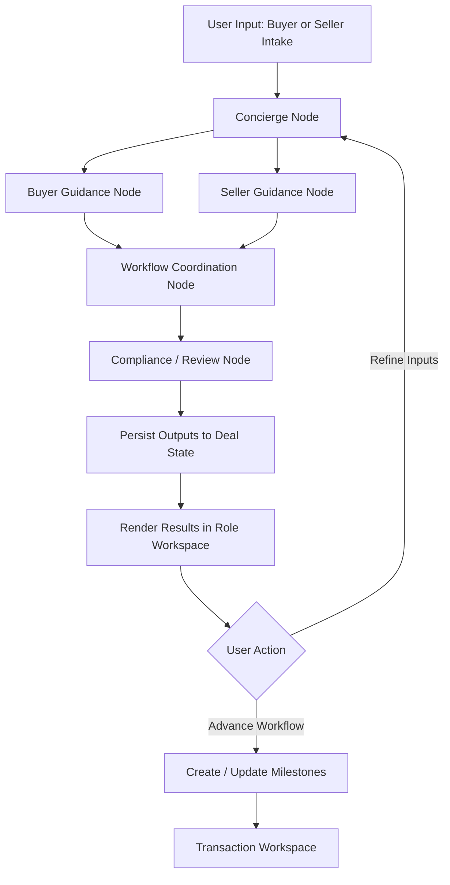

# Real Estate Transaction Assistant
## PROJECT_PLAN.md

## 1. Project Overview

**Real Estate Transaction Assistant** is an AI-assisted workflow platform designed to help buyers and sellers get organized, understand what to do next, and manage the transaction timeline.

The product focuses on reducing the **complexity and opacity of real estate transactions** by providing:

- Buyer intake and guidance
- Seller prep and listing-readiness guidance
- Shared transaction coordination
- Transaction milestone tracking
- Document organization

This MVP targets **buyer and seller decision support and coordination**, not full automation of licensed real estate roles.

The long-term vision is to evolve into a **transaction orchestration platform** for real estate workflows.

---

## 2. Objectives

### Primary Objective

Build a **minimum viable product** that enables buyers and sellers to:

1. Capture their goals, timing, and readiness
2. Receive tailored next-step guidance
3. Track the steps toward listing or purchase progress
4. Keep transaction information organized in one workspace

### Secondary Objectives

- Provide structured AI-assisted insights for both sides of the transaction
- Maintain a **persistent transaction record**
- Create a platform architecture that can evolve into a full **transaction orchestration system**

### Non-Goals (for MVP)

The MVP will **not attempt to**:

- Replace licensed real estate agents
- Automate pricing, underwriting, or negotiation decisions
- Perform escrow, title, or legal services
- Act as legal or financial advisor
- Operate as a marketplace between buyers and sellers

Instead, it focuses on **decision intelligence and workflow coordination**.

---

## 3. Target Users

### Primary Users

Home buyers and home sellers who want to:

- Better understand what to do next
- Stay on top of tasks and milestones
- Keep documents and notes organized
- Reduce transaction confusion

### Secondary Users (future)

- Listing agents
- Buyer agents
- Mortgage brokers
- Transaction coordinators

---

## 4. Product Positioning

### Core Promise

Help buyers and sellers answer four questions clearly:

1. **What should I do next?**
2. **What information do I still need?**
3. **What are the main risks or blockers?**
4. **How do I stay on track through the transaction?**

### MVP Wedge

The MVP should be positioned as:

**Buyer + Seller Transaction Assistant**

This keeps the product narrow, credible, and useful without overpromising full automation of regulated roles.

---

## 5. Core MVP Features

### 5.1 Buyer Intake

Collect buyer inputs:

- Budget
- Location preferences
- Purchase timeline
- Property priorities

These inputs drive:

- Personalized guidance
- Recommended next steps
- Checklist generation

### 5.2 Seller Intake

Collect seller inputs:

- Property address
- Selling timeline
- Property condition
- Known constraints or priorities

These inputs drive:

- Listing-readiness guidance
- Suggested prep tasks
- Document and disclosure reminders

### 5.3 Shared Checklist and Timeline

The system creates a dynamic workflow for each buyer or seller.

Example buyer milestones:

- Financing or pre-approval
- Tour and shortlist properties
- Offer preparation
- Contract milestones
- Inspection and appraisal
- Closing preparation

Example seller milestones:

- Prepare home
- Gather disclosures
- Listing preparation
- Review incoming offers
- Contract milestones
- Closing preparation

This acts as a **transaction workspace** centered on progress and coordination.

### 5.4 Guidance Layer

The system generates:

- Tailored next-step recommendations
- Readiness notes
- Risk or blocker flags
- Suggested questions to ask agents or counterparties

Outputs are suggestions only and should remain reviewable by the user.

### 5.5 Document Workspace

Users can upload or attach transaction documents such as:

- Disclosures
- Pre-approval letters
- Listing materials
- Inspection reports
- Escrow or title documents

The system should organize these by deal and make them retrievable from the workspace.

Document policy boundary:

- Raw files are stored in Supabase Storage by default.
- Document metadata and derived workflow state are stored in Supabase Postgres.
- Raw files require per-deal authorization before any read, download, preview, or processing action.
- AI processing of raw documents must be explicit and scoped. The system should not grant AI agents automatic access to every file in a deal.
- Summaries, extracted fields, and document-derived notes are sensitive data and should follow the same authorization model as the deal.
- Every document upload, access, parse, export, and AI-processing event should be audit logged.
- Future BYOS support may allow users to connect a cloud drive or external storage provider, but it should remain an optional storage mode rather than the default MVP path.

---

## 6. Technical Stack

### Frontend

**Next.js (TypeScript)**

Responsibilities:

- UI
- Dashboards
- Buyer and seller workspaces
- Forms, checklists, and workflows

Deployment target:

- Vercel

### Backend

**Next.js Route Handlers / Server Actions (TypeScript)**

Responsibilities:

- API endpoints
- Business logic
- Database interaction
- Orchestrator triggers

### Database

**Supabase (Postgres)**

Responsibilities:

- Deal state
- User data
- Checklists
- Guidance outputs
- Transaction milestones

### Storage

**Supabase Storage**

Used for:

- Disclosures
- Inspection reports
- Pre-approval letters
- Transaction documents

Security expectations:

- Private buckets only
- Short-lived signed URLs or server-mediated access only
- Storage policies tied to deal membership and role
- No public document URLs
- No broad service-level access from AI workflow components

### AI / Workflow Orchestration

**LangGraph (JavaScript/TypeScript)**

Used to coordinate structured workflows between specialized AI nodes.

### Hosting

- Frontend + backend: Vercel
- Database + auth + storage: Supabase

---

## 7. Architecture Principles

The system should be designed with the following principles:

### 7.1 Workflow First

This is a **workflow app with AI features**, not a chatbot looking for a use case.

### 7.2 Structured Deal State

The moat is the **persistent deal record**, not the chat experience.

### 7.3 Deterministic Math for Financial Outputs

Any financial calculations introduced later must be computed with deterministic code.

### 7.4 AI for Explanation and Routing

LLMs should be used for:

- Summarization
- Explanation
- Workflow coordination
- Risk highlighting

LLMs should **not** be the source of truth for financial calculations.

### 7.5 Human Escalation

Where outputs become regulated, legal, or highly sensitive, the system should escalate rather than hallucinate certainty.

### 7.6 Explicit Document Access Controls

Raw documents are not general-purpose AI context. Access to stored files must be intentionally authorized, narrowly scoped, and fully auditable.

---

## 8. System Architecture

### High-Level Architecture

```text
User
  |
  v
Next.js App (UI + Route Handlers)
  |
  +--> Supabase Auth
  +--> Supabase Postgres
  +--> Supabase Storage
  |
  v
LangGraph Workflow
  |
  +--> Concierge Node
  +--> Buyer Guidance Node
  +--> Seller Guidance Node
  +--> Workflow Coordination Node
  +--> Compliance / Review Node
```

### Runtime Flow

1. User signs in and creates a deal
2. User selects a buyer or seller workflow
3. App stores deal state in Supabase
4. User uploads or links documents into the deal workspace
5. App authorizes any document access or processing request
6. App triggers LangGraph workflow
7. Workflow reads permitted context, runs nodes, writes outputs
8. UI renders guidance, checklist items, document state, and next actions
9. User iterates until ready to proceed

### Document Access Policy

- Documents are private by default.
- Authorization must be enforced at both the application layer and the storage policy layer.
- AI workflows should consume the minimum document content required for a specific task.
- Raw document text should not be retained in prompts, logs, or derived stores unless there is a specific product need and an explicit retention policy.
- Parsed summaries should be editable, reviewable, and attributable to their source document and workflow run.
- Admin or support access to customer files should be exceptional, logged, and limited by role.
- BYOS can be introduced later for users who want external document custody, but the permission, audit, and AI-use model should remain consistent across both storage modes.

---

## 9. AI Workflow Design

LangGraph coordinates specialized workflow nodes.

### 9.1 Concierge Node

Handles:

- User intent
- Routing to the correct workflow step
- Updating deal state
- Tracking current workflow status

### 9.2 Buyer Guidance Node

Responsibilities:

- Buyer readiness guidance
- Next-step recommendation generation
- Missing-information identification
- Buyer-specific blocker flagging

### 9.3 Seller Guidance Node

Responsibilities:

- Seller prep guidance
- Listing-readiness recommendation generation
- Disclosure and prep reminders
- Seller-specific blocker flagging

### 9.4 Workflow Coordination Node

Responsibilities:

- Checklist generation
- Timeline state updates
- Milestone transitions
- Coordination between guidance outputs and persisted workflow state

### 9.5 Compliance / Review Node

Responsibilities:

- Guardrail enforcement
- Regulated language checks
- Flagging outputs requiring human review
- Logging warnings and disclaimers

---

## 10. LangGraph Workflow Diagram



### Workflow Notes

- **Concierge Node** is the entry point and router
- **Buyer Guidance** and **Seller Guidance** are selected based on deal role
- **Workflow Coordination** converts guidance into structured checklist and milestone state
- **Compliance / Review** is the final gate before presentation
- All outputs should be written back to structured deal state

---

## 11. Database Schema (Initial)

### users

```sql
id
email
created_at
```

### deals

Represents a buyer or seller transaction workspace.

```sql
id
user_id
role
status
title
timeline
created_at
updated_at
```

### profiles

```sql
id
deal_id
role
budget_max
preferred_locations
property_address
property_condition
user_priorities_json
created_at
updated_at
```

### guidance_outputs

```sql
id
deal_id
role
summary
risk_flags_json
recommended_next_steps_json
generated_at
```

### checklists

```sql
id
deal_id
title
status
due_date
metadata_json
created_at
updated_at
```

### milestones

```sql
id
deal_id
milestone_type
status
due_date
notes
created_at
updated_at
```

### documents

```sql
id
deal_id
file_path
document_type
uploaded_at
parsed_summary
```

### workflow_runs

```sql
id
deal_id
workflow_type
status
started_at
completed_at
error_message
```

### audit_logs

```sql
id
deal_id
source_node
event_type
message
created_at
```

---

## 12. Repo Structure

Recommended repo structure for the MVP:

```text
glasshouse/
├─ app/
│  ├─ (marketing)/
│  │  ├─ page.tsx
│  │  └─ pricing/page.tsx
│  ├─ dashboard/
│  │  ├─ page.tsx
│  │  ├─ deals/[dealId]/page.tsx
│  │  ├─ deals/[dealId]/buyer/page.tsx
│  │  ├─ deals/[dealId]/seller/page.tsx
│  │  ├─ deals/[dealId]/checklist/page.tsx
│  │  └─ deals/[dealId]/timeline/page.tsx
│  ├─ api/
│  │  ├─ deals/route.ts
│  │  ├─ buyers/intake/route.ts
│  │  ├─ sellers/intake/route.ts
│  │  ├─ guidance/generate/route.ts
│  │  ├─ checklists/generate/route.ts
│  │  └─ workflow/run/route.ts
│  ├─ auth/
│  │  ├─ login/page.tsx
│  │  └─ callback/route.ts
│  ├─ layout.tsx
│  └─ page.tsx
│
├─ components/
│  ├─ ui/
│  ├─ forms/
│  ├─ dashboard/
│  ├─ buyer/
│  ├─ seller/
│  ├─ checklist/
│  └─ timeline/
│
├─ lib/
│  ├─ supabase/
│  │  ├─ client.ts
│  │  ├─ server.ts
│  │  └─ middleware.ts
│  ├─ langgraph/
│  │  ├─ graph.ts
│  │  ├─ state.ts
│  │  ├─ nodes/
│  │  │  ├─ concierge.ts
│  │  │  ├─ buyer-guidance.ts
│  │  │  ├─ seller-guidance.ts
│  │  │  ├─ workflow-coordination.ts
│  │  │  └─ compliance-review.ts
│  │  └─ tools/
│  │     ├─ checklist-generator.ts
│  │     ├─ timeline-generator.ts
│  │     ├─ risk-highlighter.ts
│  │     └─ milestone-generator.ts
│  ├─ db/
│  │  ├─ queries/
│  │  └─ mutations/
│  ├─ schemas/
│  │  ├─ deal.ts
│  │  ├─ profile.ts
│  │  ├─ checklist.ts
│  │  └─ guidance.ts
│  ├─ utils/
│  │  ├─ currency.ts
│  │  ├─ dates.ts
│  │  └─ validation.ts
│  └─ constants/
│
├─ supabase/
│  ├─ migrations/
│  ├─ seed.sql
│  └─ policies.sql
│
├─ public/
│
├─ docs/
│  ├─ PROJECT_PLAN.md
│  ├─ ARCHITECTURE.md
│  ├─ API_SPEC.md
│  ├─ WORKFLOW.md
│  └─ DECISIONS.md
│
├─ tests/
│  ├─ unit/
│  ├─ integration/
│  └─ e2e/
│
├─ .env.example
├─ package.json
├─ tsconfig.json
├─ next.config.ts
├─ README.md
└─ langgraph.json
```

### Repo Structure Notes

- `app/` contains pages, route handlers, and app-level UI
- `components/` contains reusable UI and feature components
- `lib/langgraph/` contains workflow graph, nodes, tools, and state schema
- `lib/schemas/` should hold shared Zod schemas and typed DTOs
- `supabase/migrations/` should be treated as the source of truth for schema evolution
- `docs/` should contain architecture and product documentation from day one

---

## 13. Important Engineering Decisions

### 13.1 Keep the Backend Simple Early

Use Next.js route handlers and server actions first. Do not introduce NestJS, Kotlin, or microservices at MVP stage.

### 13.2 Keep AI Nodes Narrow

Each node should do one focused job. Avoid vague "super agent" behavior.

### 13.3 Store Structured Outputs

AI outputs should be stored as structured objects, not only plain text blobs.

### 13.4 Use Zod for Contracts

Define input and output contracts for:

- Buyer intake
- Seller intake
- Guidance outputs
- Checklist items

### 13.5 Add Auditability Early

Every workflow run should log:

- input snapshot
- node execution
- warnings
- final outputs

This will matter later for trust and compliance.

---

## 14. Security and Guardrails

The system must prevent unsafe or misleading outputs.

Important safeguards:

- deterministic workflow state
- audit logs for AI outputs
- disclaimers for financial/legal advice
- confidence checks where appropriate
- human review escalation for critical decisions

Examples:

- Allowed: "Here are the next steps commonly needed before listing"
- Not allowed: "This property is definitely ready to list"
- Allowed: "Here are possible questions to ask your agent"
- Not allowed: "This contract language is legally safe"

---

## 15. Development Phases

### Phase 1 — Foundation

Deliverables:

- Next.js app scaffold
- Supabase project setup
- Auth flow
- Deal creation flow
- Base schema and migrations

### Phase 2 — Buyer and Seller Intake

Deliverables:

- Buyer profile form
- Seller intake form
- Role-based deal creation
- Intake persistence

### Phase 3 — Guidance and Checklists

Deliverables:

- Guidance generation
- Checklist generation
- Role-specific next-step cards
- Risk and blocker summaries

### Phase 4 — Transaction Workspace

Deliverables:

- Milestone generation
- Timeline view
- Document uploads
- Workflow run history

### Phase 5 — Expanded Intelligence

Deliverables:

- More tailored guidance prompts
- Better milestone automation
- Optional financial tools where relevant
- Human review and compliance hardening

---

## 16. Success Metrics

Initial metrics to evaluate product viability:

- Number of deals created
- Buyer intake completion rate
- Seller intake completion rate
- Checklist engagement rate
- Return usage per active deal

Long-term metrics:

- Paid users
- Team / agent adoption
- Deals supported through closing
- Conversion from free workspace to paid plan

---

## 17. Future Extensions

Potential platform expansions:

- Lender integrations
- Escrow integrations
- MLS / listing data integrations
- Automated document extraction
- Agent collaboration tools
- Buyer + agent shared workspace
- Transaction coordinator workflows
- Compliance review queue
- B2B white-labeled version for teams

Long-term goal:

**AI-driven real estate transaction orchestration platform**

---

## 18. Guiding Principle

The product should behave like:

> **A transaction workspace with AI assistance**

not:

> **a chatbot pretending to be a real estate agent**

The long-term value lies in:

- structured deal workflows
- persistent transaction context
- trustworthy decision support
- operational simplicity for both buyer and seller

---

## 19. First Build Recommendation

If building this as a solo or small-team MVP, start with exactly this scope:

- Auth
- Create deal
- Select buyer or seller role
- Complete intake
- Generate guidance
- Generate checklist
- Render timeline and workspace
- Save outputs to workspace

That is enough to test user value and early willingness to pay.

Do not start with marketplace mechanics or multi-party coordination.
