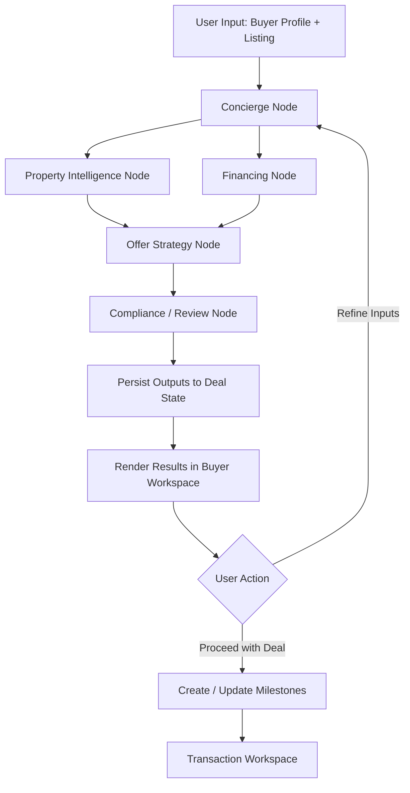

# Real Estate Transaction Copilot  
## PROJECT_PLAN.md

## 1. Project Overview

**Real Estate Transaction Copilot** is an AI-assisted workflow platform designed to help buyers, and eventually buyer agents, analyze properties, model financing, structure offers, and manage the transaction timeline.

The product focuses on reducing the **complexity and opacity of real estate transactions** by providing:

- Property intelligence
- Financing scenario modeling
- Offer guidance
- Transaction milestone tracking
- Document organization

This MVP targets **buyer-side decision support and coordination**, not full automation of licensed real estate roles.

The long-term vision is to evolve into a **transaction orchestration platform** for real estate workflows.

---

## 2. Objectives

### Primary Objective

Build a **minimum viable product** that enables buyers to:

1. Analyze a property listing
2. Evaluate affordability and financing scenarios
3. Generate an offer strategy
4. Track the steps toward closing

### Secondary Objectives

- Provide structured AI-assisted insights for buyers
- Maintain a **persistent transaction record**
- Create a platform architecture that can evolve into a full **transaction orchestration system**

### Non-Goals (for MVP)

The MVP will **not attempt to**:

- Replace licensed real estate agents
- Automate mortgage underwriting
- Perform escrow/title services
- Act as legal or financial advisor
- Connect buyers and sellers directly

Instead, it focuses on **decision intelligence and workflow coordination**.

---

## 3. Target Users

### Primary Users

Home buyers who want to:

- Better understand properties
- Model affordability
- Structure offers
- Manage transaction steps

### Secondary Users (future)

- Buyer agents
- Mortgage brokers
- Transaction coordinators

---

## 4. Product Positioning

### Core Promise

Help buyers answer four questions clearly:

1. **Can I afford this property?**
2. **What is a reasonable offer?**
3. **What are the main risks?**
4. **What happens next in the transaction?**

### MVP Wedge

The MVP should be positioned as:

**AI Offer Desk / Buyer Transaction Copilot**

This keeps the product narrow, credible, and monetizable without overpromising full automation of regulated roles.

---

## 5. Core MVP Features

### 5.1 Buyer Profile

Collect buyer inputs:

- Budget
- Income
- Down payment
- Location preferences
- Purchase timeline

These inputs drive:

- Affordability modeling
- Financing scenarios
- Offer recommendations

### 5.2 Property Analysis

Users provide a listing URL or property details.

System generates:

- Property summary
- Risk flags
- Estimated comparable price band
- HOA and disclosure summaries
- Notes for negotiation

### 5.3 Financing Scenarios

Deterministic mortgage calculations including:

- Estimated monthly payment
- Principal + interest
- Taxes and insurance estimates
- Cash to close
- Down payment scenarios

The LLM explains scenarios while calculations are done with **deterministic code**.

### 5.4 Offer Builder

The system proposes:

- Estimated offer range
- Negotiation strategies
- Potential seller concessions
- Inspection considerations

Outputs are suggestions only.

### 5.5 Transaction Timeline

Once a user moves toward a purchase, the system creates a timeline.

Example milestones:

- Offer submitted
- Offer accepted
- Earnest deposit
- Inspection period
- Appraisal
- Loan approval
- Closing

This acts as a **transaction workspace**.

### 5.6 Document Workspace

Users can upload or attach transaction documents such as:

- Disclosures
- Pre-approval letters
- Inspection reports
- Escrow documents

The system should organize these by deal and make them retrievable from the workspace.

---

## 6. Technical Stack

### Frontend

**Next.js (TypeScript)**

Responsibilities:

- UI
- Dashboards
- Deal workspace
- Forms and workflows

Deployment target:

- Vercel

### Backend

**Next.js Route Handlers / Server Actions (TypeScript)**

Responsibilities:

- API endpoints
- Business logic
- Database interaction
- Orchestrator triggers

### Database

**Supabase (Postgres)**

Responsibilities:

- Deal state
- User data
- Financing scenarios
- Offer history
- Transaction milestones

### Storage

**Supabase Storage**

Used for:

- Disclosures
- Inspection reports
- Pre-approval letters
- Transaction documents

### AI / Workflow Orchestration

**LangGraph (JavaScript/TypeScript)**

Used to coordinate structured workflows between specialized AI nodes.

### Hosting

- Frontend + backend: Vercel
- Database + auth + storage: Supabase

---

## 7. Architecture Principles

The system should be designed with the following principles:

### 7.1 Workflow First

This is a **workflow app with AI features**, not a chatbot looking for a use case.

### 7.2 Structured Deal State

The moat is the **persistent deal record**, not the chat experience.

### 7.3 Deterministic Math for Financial Outputs

Mortgage, payment, and affordability calculations must be computed with deterministic code.

### 7.4 AI for Explanation and Routing

LLMs should be used for:

- Summarization
- Explanation
- Workflow coordination
- Risk highlighting

LLMs should **not** be the source of truth for financial calculations.

### 7.5 Human Escalation

Where outputs become regulated, legal, or highly sensitive, the system should escalate rather than hallucinate certainty.

---

## 8. System Architecture

### High-Level Architecture

```text
User
  |
  v
Next.js App (UI + Route Handlers)
  |
  +--> Supabase Auth
  +--> Supabase Postgres
  +--> Supabase Storage
  |
  v
LangGraph Workflow
  |
  +--> Concierge Node
  +--> Property Intelligence Node
  +--> Financing Node
  +--> Offer Strategy Node
  +--> Compliance / Review Node
```

### Runtime Flow

1. User signs in and creates a deal
2. User enters buyer profile and listing
3. App stores deal state in Supabase
4. App triggers LangGraph workflow
5. Workflow reads context, runs nodes, writes outputs
6. UI renders analysis, financing scenarios, and next actions
7. User iterates until ready to proceed

---

## 9. AI Workflow Design

LangGraph coordinates specialized workflow nodes.

### 9.1 Concierge Node

Handles:

- User intent
- Routing to the correct workflow step
- Updating deal state
- Tracking current workflow status

### 9.2 Property Intelligence Node

Responsibilities:

- Listing parsing
- Property summary
- Comparable estimation
- Risk flagging
- HOA / disclosure summarization

### 9.3 Financing Node

Responsibilities:

- Affordability estimation
- Loan scenario modeling
- Payment calculation
- Cash-to-close estimates

This node must use deterministic financial functions.

### 9.4 Offer Strategy Node

Responsibilities:

- Suggested offer range
- Negotiation notes
- Concession ideas
- Contingency considerations

### 9.5 Compliance / Review Node

Responsibilities:

- Guardrail enforcement
- Regulated language checks
- Flagging outputs requiring human review
- Logging warnings and disclaimers

---

## 10. LangGraph Workflow Diagram



### Workflow Notes

- **Concierge Node** is the entry point and router
- **Property Intelligence** and **Financing** can run independently, then merge
- **Offer Strategy** depends on both property and financing context
- **Compliance / Review** is the final gate before presentation
- All outputs should be written back to structured deal state

---

## 11. Database Schema (Initial)

### users

```sql
id
email
created_at
```

### deals

Represents a buyer transaction workspace.

```sql
id
user_id
status
target_location
purchase_timeline
created_at
updated_at
```

### buyer_profiles

```sql
id
deal_id
budget_max
income_annual
down_payment_amount
credit_range
preferred_locations
created_at
updated_at
```

### properties

```sql
id
deal_id
address
listing_price
bedrooms
bathrooms
sqft
hoa_fee
listing_url
analysis_summary
risk_flags_json
created_at
updated_at
```

### financing_scenarios

```sql
id
deal_id
loan_amount
interest_rate
loan_term_years
monthly_payment
cash_to_close
down_payment
property_tax_estimate
insurance_estimate
created_at
```

### offers

```sql
id
deal_id
offer_price
offer_notes
recommended_low
recommended_high
contingencies_json
created_at
```

### milestones

```sql
id
deal_id
milestone_type
status
due_date
notes
created_at
updated_at
```

### documents

```sql
id
deal_id
file_path
document_type
uploaded_at
parsed_summary
```

### workflow_runs

```sql
id
deal_id
workflow_type
status
started_at
completed_at
error_message
```

### audit_logs

```sql
id
deal_id
source_node
event_type
message
created_at
```

---

## 12. Repo Structure

Recommended repo structure for the MVP:

```text
real-estate-copilot/
├─ app/
│  ├─ (marketing)/
│  │  ├─ page.tsx
│  │  └─ pricing/page.tsx
│  ├─ dashboard/
│  │  ├─ page.tsx
│  │  ├─ deals/[dealId]/page.tsx
│  │  ├─ deals/[dealId]/property/page.tsx
│  │  ├─ deals/[dealId]/financing/page.tsx
│  │  ├─ deals/[dealId]/offer/page.tsx
│  │  └─ deals/[dealId]/timeline/page.tsx
│  ├─ api/
│  │  ├─ deals/route.ts
│  │  ├─ listings/analyze/route.ts
│  │  ├─ financing/scenarios/route.ts
│  │  ├─ offers/recommend/route.ts
│  │  └─ workflow/run/route.ts
│  ├─ auth/
│  │  ├─ login/page.tsx
│  │  └─ callback/route.ts
│  ├─ layout.tsx
│  └─ page.tsx
│
├─ components/
│  ├─ ui/
│  ├─ forms/
│  ├─ dashboard/
│  ├─ property/
│  ├─ financing/
│  ├─ offer/
│  └─ timeline/
│
├─ lib/
│  ├─ supabase/
│  │  ├─ client.ts
│  │  ├─ server.ts
│  │  └─ middleware.ts
│  ├─ langgraph/
│  │  ├─ graph.ts
│  │  ├─ state.ts
│  │  ├─ nodes/
│  │  │  ├─ concierge.ts
│  │  │  ├─ property-intelligence.ts
│  │  │  ├─ financing.ts
│  │  │  ├─ offer-strategy.ts
│  │  │  └─ compliance-review.ts
│  │  └─ tools/
│  │     ├─ mortgage-calculator.ts
│  │     ├─ affordability.ts
│  │     ├─ listing-parser.ts
│  │     ├─ comp-estimator.ts
│  │     └─ milestone-generator.ts
│  ├─ db/
│  │  ├─ queries/
│  │  └─ mutations/
│  ├─ schemas/
│  │  ├─ deal.ts
│  │  ├─ property.ts
│  │  ├─ financing.ts
│  │  └─ offer.ts
│  ├─ utils/
│  │  ├─ currency.ts
│  │  ├─ dates.ts
│  │  └─ validation.ts
│  └─ constants/
│
├─ supabase/
│  ├─ migrations/
│  ├─ seed.sql
│  └─ policies.sql
│
├─ public/
│
├─ docs/
│  ├─ PROJECT_PLAN.md
│  ├─ ARCHITECTURE.md
│  ├─ API_SPEC.md
│  ├─ WORKFLOW.md
│  └─ DECISIONS.md
│
├─ tests/
│  ├─ unit/
│  ├─ integration/
│  └─ e2e/
│
├─ .env.example
├─ package.json
├─ tsconfig.json
├─ next.config.ts
├─ README.md
└─ langgraph.json
```

### Repo Structure Notes

- `app/` contains pages, route handlers, and app-level UI
- `components/` contains reusable UI and feature components
- `lib/langgraph/` contains workflow graph, nodes, tools, and state schema
- `lib/schemas/` should hold shared Zod schemas and typed DTOs
- `supabase/migrations/` should be treated as the source of truth for schema evolution
- `docs/` should contain architecture and product documentation from day one

---

## 13. Important Engineering Decisions

### 13.1 Keep the Backend Simple Early

Use Next.js route handlers and server actions first. Do not introduce NestJS, Kotlin, or microservices at MVP stage.

### 13.2 Keep AI Nodes Narrow

Each node should do one focused job. Avoid vague "super agent" behavior.

### 13.3 Store Structured Outputs

AI outputs should be stored as structured objects, not only plain text blobs.

### 13.4 Use Zod for Contracts

Define input and output contracts for:

- Buyer profile
- Property analysis
- Financing scenarios
- Offer recommendations

### 13.5 Add Auditability Early

Every workflow run should log:

- input snapshot
- node execution
- warnings
- final outputs

This will matter later for trust and compliance.

---

## 14. Security and Guardrails

The system must prevent unsafe or misleading outputs.

Important safeguards:

- deterministic financial calculations
- audit logs for AI outputs
- disclaimers for financial/legal advice
- confidence checks where appropriate
- human review escalation for critical decisions

Examples:

- Allowed: "Here is an estimated payment scenario"
- Not allowed: "You are definitely approved for this mortgage"
- Allowed: "Here are possible offer considerations"
- Not allowed: "This contract language is legally safe"

---

## 15. Development Phases

### Phase 1 — Foundation

Deliverables:

- Next.js app scaffold
- Supabase project setup
- Auth flow
- Deal creation flow
- Base schema and migrations

### Phase 2 — Buyer Intake + Property Analysis

Deliverables:

- Buyer profile form
- Listing input flow
- Property summary
- Risk analysis
- Comparable estimate stub

### Phase 3 — Financing Engine

Deliverables:

- Mortgage calculator
- Affordability scenarios
- Cash-to-close estimate
- Financing summary card

### Phase 4 — Offer Workspace

Deliverables:

- Offer recommendation range
- Negotiation notes
- Contingency options
- Offer history

### Phase 5 — Transaction Workspace

Deliverables:

- Milestone generation
- Timeline view
- Document uploads
- Workflow run history

---

## 16. Success Metrics

Initial metrics to evaluate product viability:

- Number of deals created
- Number of listings analyzed
- Financing scenario usage rate
- Offer recommendation usage rate
- Return usage per active deal

Long-term metrics:

- Paid users
- Team / agent adoption
- Deals supported through closing
- Conversion from free workspace to paid plan

---

## 17. Future Extensions

Potential platform expansions:

- Lender integrations
- Escrow integrations
- MLS / listing data integrations
- Automated document extraction
- Agent collaboration tools
- Buyer + agent shared workspace
- Transaction coordinator workflows
- Compliance review queue
- B2B white-labeled version for teams

Long-term goal:

**AI-driven real estate transaction orchestration platform**

---

## 18. Guiding Principle

The product should behave like:

> **A transaction workspace with AI assistance**

not:

> **a chatbot pretending to be a real estate agent**

The long-term value lies in:

- structured deal workflows
- persistent transaction context
- trustworthy decision support
- operational simplicity for the buyer

---

## 19. First Build Recommendation

If building this as a solo or small-team MVP, start with exactly this scope:

- Auth
- Create deal
- Enter buyer profile
- Paste listing
- Run property analysis
- Run financing scenarios
- Produce offer recommendation
- Save outputs to workspace

That is enough to test user value and early willingness to pay.

Do not start with marketplace mechanics or multi-party coordination.
